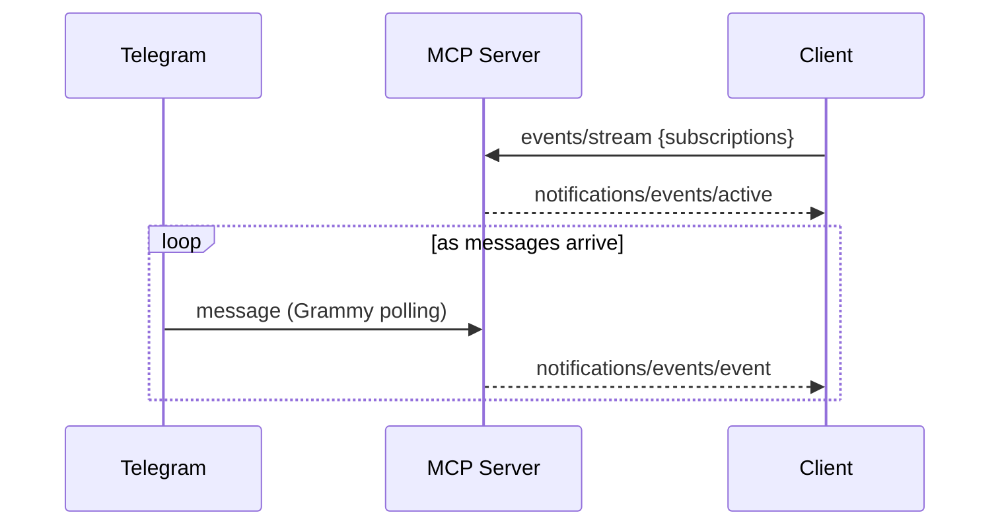
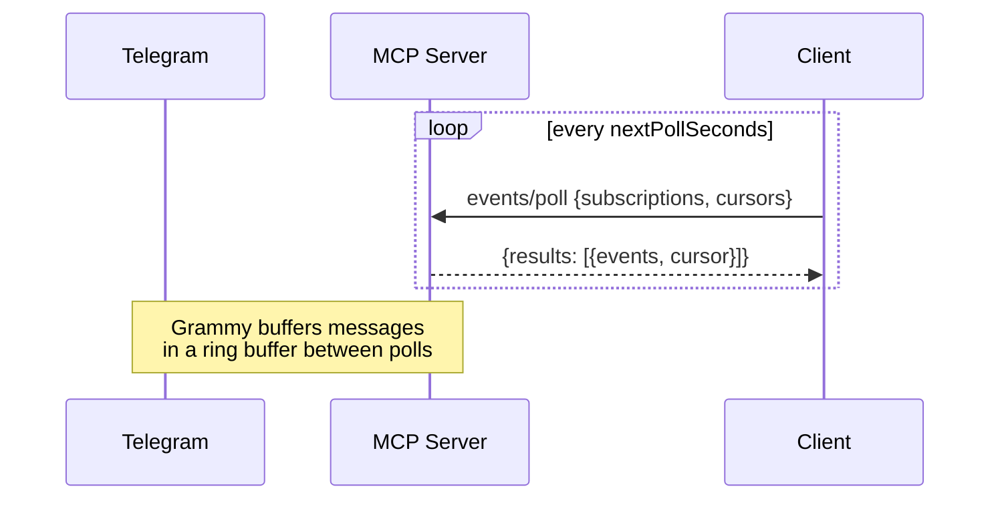
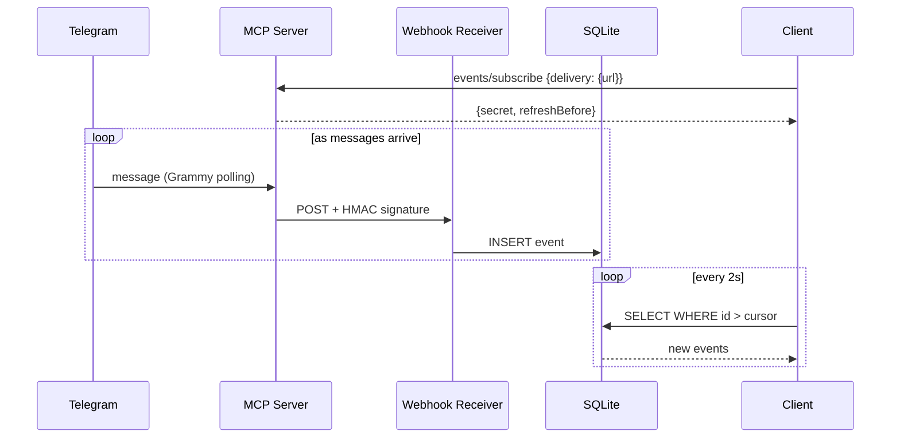

# Telegram MCP Server

MCP server that exposes Telegram Bot API operations as tools and inbound Telegram messages as MCP Events (push, poll, and webhook delivery). Supports stdio and HTTP transports.

This is meant as a proof of concept for the
[MCP Events design sketch proposal](https://github.com/modelcontextprotocol/experimental-ext-triggers-events/blob/pja/design-sketch/docs/design-sketch-proposal.md).

### Sample interaction

The sample client is an interactive chatbot that uses this Telegram MCP server and the [`time` MCP server](https://pypi.org/project/mcp-server-time/).

You can chat directly with the agent in the terminal:

```
You: What time is it in New York?
Assistant:
🔧 Tool #1: get_current_time
✓ Tool completed
It's currently **11:45 AM** on **Thursday, April 16, 2026** in New York. 🗽
```

When someone messages the Telegram bot, the same agent sees it and replies in Telegram using its `reply` tool:

In Telegram:
```
To bot: What time is it in Seattle?
From bot: It's currently 8:45 AM on Thursday, April 16, 2026 in Seattle! 🌲
```

In the agent:
```
📨 [Telegram event] Message from user 1234 in chat_id 5678 (message_id 24): What time is it in Seattle?

Assistant:
🔧 Tool #1: get_current_time
✓ Tool completed
🔧 Tool #2: reply
✓ Tool completed
Replied to the Telegram user! It's **8:45 AM** in Seattle.
```

## Setup

### 1. Create a bot with BotFather

Open a chat with [@BotFather](https://t.me/BotFather) on Telegram and send `/newbot`. BotFather asks for:

- **Name** — display name shown in chat headers (anything, can contain spaces)
- **Username** — unique handle ending in `bot` (e.g. `my_assistant_bot`)

BotFather replies with a token like `123456789:AAHfiqksKZ8...`.

### 2. Install and build

```bash
npm run install:all && npm run build:all
```

## Usage

First, set `TELEGRAM_BOT_TOKEN` in an `.env` file:

```bash
echo "TELEGRAM_BOT_TOKEN=123456789:AAHfiqksKZ8..." > .env
```

For webhook delivery, also add `WEBHOOK_URL` and `WEBHOOK_SECRET`:

```bash
echo "WEBHOOK_URL=http://localhost:8080/hooks" >> .env
echo "WEBHOOK_SECRET=$(openssl rand -base64 32)" >> .env
```

The server and client both auto-load the `.env` file. You can also set the env vars directly.

### Start stdio server (default)

```bash
npm start
```

### Start HTTP server

```bash
npm run start:http
# Listens on http://127.0.0.1:3000/mcp
# Set PORT env var to change the port.
```

### MCP client config (stdio)

```json
{
  "mcpServers": {
    "telegram": {
      "command": "node",
      "args": ["dist/server.js"],
      "env": {
        "TELEGRAM_BOT_TOKEN": "<your-token>"
      }
    }
  }
}
```

### MCP client config (HTTP)

```json
{
  "mcpServers": {
    "telegram": {
      "url": "http://127.0.0.1:3000/mcp"
    }
  }
}
```

## Tools

| Tool | Description |
|------|-------------|
| `reply` | Send a text message to a chat, with optional threading |
| `react` | Add an emoji reaction to a message |
| `download_attachment` | Download a file attachment, returns URL |
| `edit_message` | Edit a previously sent message |

## Events

The server implements push, poll, and webhook delivery.
Grammy polls Telegram for inbound messages and delivers them to subscribed clients.

| Event | Delivery | Description |
|-------|----------|-------------|
| `telegram.message` | push, poll, webhook | Fires when the bot receives a text, photo, or document message |

### Push delivery

Client opens a long-lived `events/stream` request. Events are delivered as notifications on the same connection.



### Poll delivery

Client calls `events/poll` at the server-recommended interval. No persistent connection needed.



### Webhook delivery

Server POSTs HMAC-signed events to a callback URL. A standalone webhook receiver stores them in SQLite; the client polls the database.



### Events subscription

Clients subscribe via `events/stream` (push) or `events/poll` (poll). The server confirms push subscriptions with `notifications/events/active` and delivers events as `notifications/events/event` notifications. Poll clients call `events/poll` at the server-recommended interval.

For webhook delivery, clients call `events/subscribe` with a callback URL. The server POSTs events with HMAC-SHA256 signatures (`X-MCP-Signature`, `X-MCP-Timestamp` headers). Subscriptions have a 1-minute TTL (for demo; set longer for production) and must be refreshed before `refreshBefore`.

## Client (Strands Agents SDK)

A minimal interactive chatbot that connects to the server, subscribes to Telegram events, and routes both terminal input and inbound Telegram messages through an LLM agent.

- Terminal messages get a direct text response
- Telegram messages are automatically queued and fed into the agent loop; the agent uses the `reply` tool to respond in the Telegram chat

### Model provider

Set `MODEL_PROVIDER` to choose the LLM backend. Override the model with `MODEL_ID`.

| `MODEL_PROVIDER` | Default `MODEL_ID` | Credentials needed |
|---|---|---|
| `bedrock` (default) | `global.anthropic.claude-sonnet-4-6` | AWS credentials |
| `anthropic` | `claude-sonnet-4-6` | `ANTHROPIC_API_KEY` |
| `openai` | `gpt-5.4` | `OPENAI_API_KEY` |

Example:
```bash
MODEL_PROVIDER=anthropic ANTHROPIC_API_KEY=sk-ant-... npm run client:start
```

### Transport × delivery matrix

| | push (default) | poll | webhook |
|---|---|---|---|
| **stdio** (default) | `npm run client:start` | `npm run client:start:poll` | `npm run client:start:webhook` |
| **HTTP** (`--http`) | `npm run client:start:http` | `npm run client:start:http:poll` | `npm run client:start:http:webhook` |

### stdio (default — client spawns the server automatically)

```bash
npm run client:start
```

By default the client uses push delivery (`events/stream`). To use poll delivery instead:

```bash
npm run client:start:poll
```

### HTTP (connect to an already-running server)

Start the server in one terminal:
```bash
npm run start:http
```

Then run the client in another:
```bash
npm run client:start:http
# Connects to http://127.0.0.1:3000/mcp by default.
# Set MCP_SERVER_URL to override.
```

Or with poll delivery:
```bash
npm run client:start:http:poll
```

### Webhook delivery

Webhook mode uses three processes to simulate a production architecture:

1. **MCP server** — POSTs HMAC-signed events to the webhook URL
2. **Webhook receiver** — express app that verifies signatures and stores events in SQLite
3. **Client** — polls the SQLite database for new events and feeds them to the agent

The webhook receiver and client share a SQLite database for storing and receiving incoming messages.
In production, this could be a message queue or database (e.g., Amazon SQS, Kafka, Redis, PostgreSQL).

The client passes `WEBHOOK_SECRET` to the server via `delivery.secret` in `events/subscribe`. The server uses it to sign POSTs; the webhook receiver uses it to verify signatures. Both read the same secret from `.env`.

Start the webhook receiver (in its own terminal):
```bash
npm run webhook-receiver:start
# Listens on http://localhost:8080/hooks by default (set WEBHOOK_PORT to change)
```

Then start the client with webhook delivery:
```bash
npm run client:start:webhook
# Set WEBHOOK_URL (default http://localhost:8080/hooks)
# Set WEBHOOK_DB to share the same SQLite path (default ./webhooks.db)
```

For HTTP transport with webhook delivery, start all three separately:
```bash
# Terminal 1: MCP server
npm run start:http

# Terminal 2: webhook receiver
npm run webhook-receiver:start

# Terminal 3: client
npm run client:start:http:webhook
```

## Notes

- Telegram's Bot API exposes **no message history or search**. The bot only sees messages as they arrive. If you need earlier context, ask the user to paste or summarize.
- Telegram only accepts a [fixed whitelist of emoji](https://core.telegram.org/bots/api#reactiontypeemoji) for reactions — non-whitelisted emoji will be rejected.
- Telegram caps bot file downloads at 20MB.

## Acknowledgements

Inspired by the Telegram plugin in [anthropics/claude-plugins-official](https://github.com/anthropics/claude-plugins-official) (Apache-2.0).
